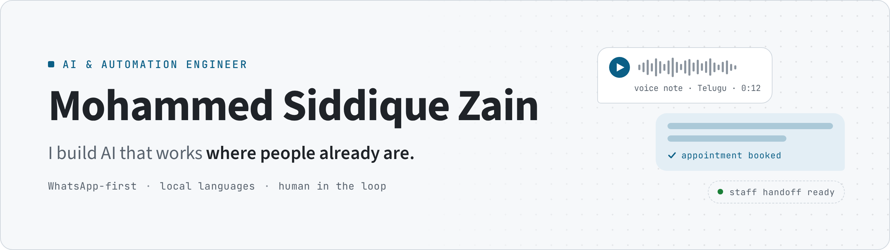

<picture>
  <source media="(prefers-color-scheme: dark)" srcset="./assets/banner-dark.png">
  
</picture>

I build AI that works where people already are: on WhatsApp, in their own language, with a human one step away. My booking assistant has served **1,400+ patients across 3 clinics** in Hyderabad, and I'm now turning it into MedFlow, a multi-tenant clinic platform.

Full-stack developer at Origin Softwares since 2024. Founder of a small AI automation practice for clinics and real-estate firms. B.E. CSE (AI & ML) at Lords Institute of Engineering and Technology, graduating 2028.

[LinkedIn](https://www.linkedin.com/in/siddiquezain/) · [Email](mailto:siddique.zain19@gmail.com) · Hyderabad, India

### Selected work

**[orbiflare](https://github.com/siddiquezain/orbiflare)** — Satellite thermal-anomaly triage for India  
NASA FIRMS hotspots → RandomForest classifier evaluated on a spatial holdout → analyst dashboard. 1,213 Indian detections scored, 186 tests.

**[resolve-sih](https://github.com/siddiquezain/resolve-sih)** — At what scale can you trust an extreme-rain forecast?  
Fractions Skill Score across 10 successive ECMWF ensemble runs. For Cyclone Montha, useful skill appeared six days out at 362 km and tightened to 195 km two days before landfall.

**[chronobrain](https://github.com/siddiquezain/chronobrain)** — F1 energy-deployment decision engine, TrackShift 2026 finalist  
Particle-filter inference of rivals' battery state, 10k-rollout Monte Carlo ranking, five significance gates. Python computes; the LLM only explains.

### Recognition

- **Runner-up, 2nd overall** · AMIEE National Innovation Hackathon 2026, for *Nyaya Sakhi*, a WhatsApp legal-rights assistant for women in Telugu, Hindi and English
- **Finalist** · TrackShift 2026, powered by TGR Haas F1 Team · one of two Hyderabad teams with direct entry

### How I build

- **Code decides, the model explains.** Numbers come from tested code; the LLM narrates verified output.
- **Meet people where they are.** WhatsApp and voice before new apps, local languages before English-only.
- **Say "not sure".** Confidence gates and human handoff beat a confident wrong answer.

### Stack

Python · TypeScript · Next.js · React · Supabase (Postgres) · Prisma · n8n · WhatsApp (Evolution API) · Gemini · OpenAI · Anthropic
